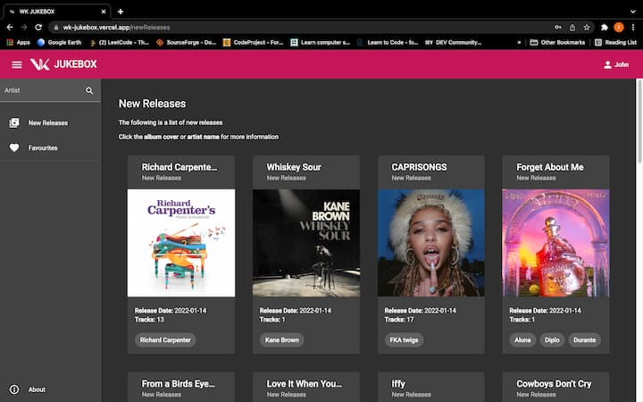
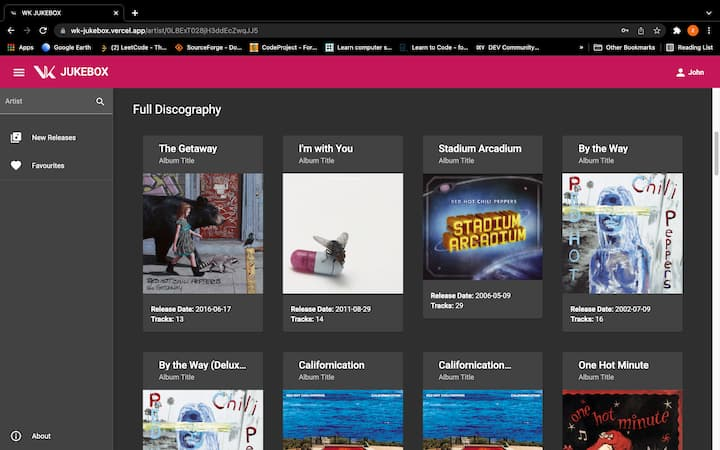
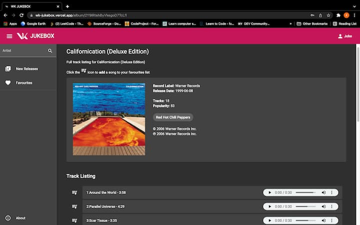
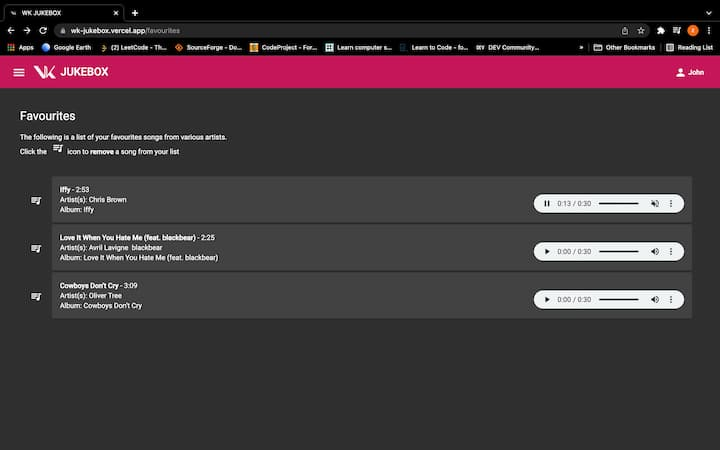
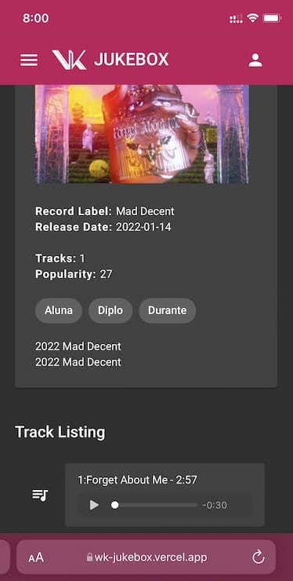
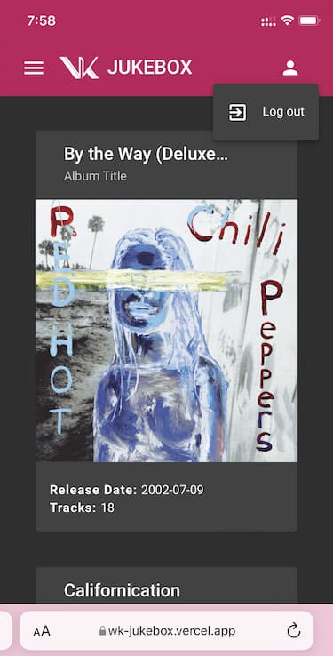

# MEAN full-stack Application Using Spotify API 

 This project is MEAN full stack music application using Spotify API. 
[WK JukeBox Link](https://wk-jukebox.vercel.app)
 This application provides below features.   

> User Registration and Authentication
- User name and password verification and store on MongoDB 
- Protecting routes to unauthorized users
- Manager user's favourite tracks

> Browsing Content
- New releases on main screen provided by Spotify API
- Artist search on side bar
- Artist and album links are connected to relevant artist/album pages
- Music preview is provided based on preview availability

> About 
- Developer intro page
 

## This application is fully responsive on mobile screens! 

## Backend Repository Link

[WK JukeBox backend repo](https://github.com/Genne23v/wk-jukebox-backend)
